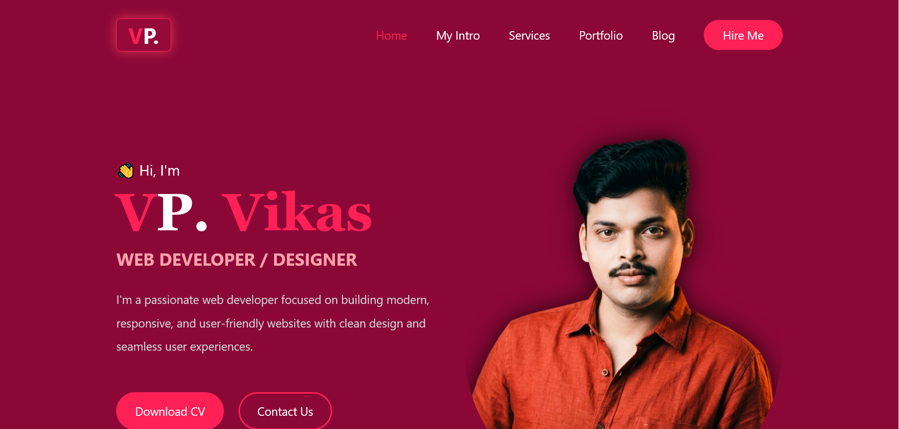

# 💼 VP Vikas - Personal Portfolio

Welcome to my personal portfolio website!  
This project showcases my skills, projects, and experience as a Frontend Developer.

---

## 🚀 Live Demo

👉 Visit Website:  
https://vikaspawar-dev.github.io/vp-portfolio/

---

## 👨‍💻 About Me

I am **Vikas Pawar**, a passionate Frontend Developer specializing in:

- HTML, CSS, JavaScript
- React.js
- Tailwind CSS
- ASP.NET Basics
- Responsive Web Design

I love building modern, clean, and user-friendly web applications.

---

## 🛠️ Tech Stack

- HTML5
- Tailwind CSS
- JavaScript (Vanilla)
- Font Awesome Icons

---

## 📸 Screenshots

### Home Page


### Projects / UI


---

## 📂 Project Structure
assets/
index.html
README.md
screenshot1.png
screenshot2.png


---

## ✨ Features

- Fully Responsive Design 📱💻
- Modern UI with Tailwind CSS 🎨
- Smooth Navigation
- Interactive Blog Section (Read More Toggle)
- Social Media Integration

---

## 📬 Contact

- 📧 Email: pvikasrmc@gmail.com  
- 📱 WhatsApp: 7218739737  
- 🔗 LinkedIn: https://www.linkedin.com/in/vikas-pawar-74468a183  
- 🐙 GitHub: https://github.com/vikaspawar-dev  

---

## ⭐ Show Your Support

If you like this project, feel free to ⭐ star the repository!

---

## 🧑‍💻 Developed By

**Vikas Pawar**
Frontend Developer
```
